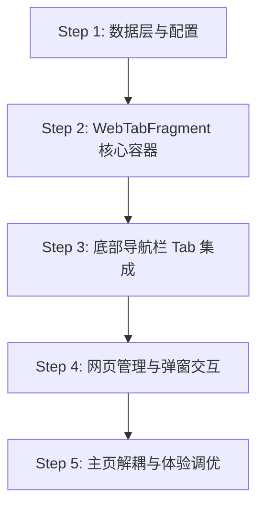

# 底部「网页」Tab 独立容器与 JS Bridge 方案设计

## 一、需求背景与目标

1. **解耦主页 WebHome 强接管机制**：
   - 现有点播主页（`VodFragment`）在站点具备 `homePage` 时会直接隐藏原生瀑布流并强行替换为 WebView。
   - 改造目标：让点播主页彻底回归纯原生列表体验，不再受 `homePage` 干扰。
2. **新增底部独立「网页」Tab 容器**：
   - 在手机端底部悬浮胶囊导航栏中新增「网页」选项（点播、收藏、**网页**、设置）。
   - 用户可自定义添加多个网页（支持本地服务如 `http://127.0.0.1:9988/...` 或在线 `https://...` 网页）。
3. **保留并完整注入 Native 能力（`window.fongmi`）**：
   - 网页容器完整挂载 `HomeWebBridge`，让任意自定义 Web 页面都能直接调用原生播放器、OkHttp 跨域网络请求、本地持久化缓存、网盘检测与直推等能力。

---

## 二、系统架构与交互设计

### 1. 界面与交互布局

```
┌────────────────────────────────────────────────────────┐
│  [当前网页名称 ▼]                 [全屏] [刷新] [＋添加] │ ◄── 顶部工具栏（可折叠）
├────────────────────────────────────────────────────────┤
│                                                        │
│                                                        │
│                     WebView 主体                       │
│              (已注入全局 window.fongmi)                 │
│                                                        │
│                                                        │
├────────────────────────────────────────────────────────┤
│          ( 🎬点播   ⭐收藏   🌐网页   ⚙️设置 )          │ ◄── 底部悬浮胶囊导航栏
└────────────────────────────────────────────────────────┘
```

### 2. 核心功能点
* **网页多标签/快速切换**：
  - 顶部下拉卡片列出所有已保存网页，点击立即切换加载。
  - 支持设置默认启动打开的网页。
* **网页增删改查管理 (`WebPageDialog`)**：
  - **添加/编辑**：输入名称、网页 URL、可选自定义 User-Agent / 请求头。
  - **内置快捷模板**：提供「本地 Node 服务 (9988)」、「网盘配置页」、「夸克扫码」等一键快捷添加预设。
  - **删除与排序**：支持对不需要的网页进行删除与管理。
* **沉浸式与全屏体验**：
  - 点击全屏按钮或由网页调用 `window.fongmi.ui.setToolbar(false)` 时，自动隐藏顶部工具栏与底部胶囊导航栏，实现满屏沉浸式网页浏览。
* **物理返回键拦截**：
  - 优先触发 WebView 内部历史记录后退（`webView.goBack()`）。
  - 若已无上一页或处于全屏模式，则退出全屏或切回点播主页。

---

## 三、底层数据模型与通信协议

### 1. 数据实体定义 (`WebPage.java`)
```java
public class WebPage {
    private String id;           // 唯一ID (UUID)
    private String name;         // 网页名称（如：网盘设置、影视前端）
    private String url;          // 目标地址 (https://... 或 http://127.0.0.1:9988/...)
    private String ua;           // 自定义 User-Agent（可选）
    private boolean isDefault;   // 是否为默认打开页
    private long createTime;     // 创建时间
}
```

### 2. Native 注入能力清单 (`window.fongmi` / `window.fm`)

| 命名空间 | 关键 API | 说明 |
|---|---|---|
| **`fongmi.player`** | `playUrl(url, title, opt)`<br>`playVod(siteKey, id, ...)`<br>`control(action)`<br>`status()` | 拉起原生播放器全屏播放直链/VOD；控制后台播放器播放、暂停、下一集；查询当前播放状态 |
| **`fongmi.net`** | `request(url, opt)`<br>`resourceUrl(url, opt)` | 通过原生底层 OkHttp 发起跨域请求（彻底解决浏览器 CORS 限制）；防盗链资源反代地址转换 |
| **`fongmi.pan`** | `play(opt)`<br>`check(items)` | 播放网盘资源（支持 `push://` 等协议）；批量检测网盘资源有效性 |
| **`fongmi.cache`** | `get(key)` / `set(key, val)` / `del(key)` | 本地持久化键值存储 |
| **`fongmi.app`** | `search(keyword)`<br>`openVod()` / `openSetting()` | 唤起原生搜索界面或切换功能模块 |
| **`fongmi.ui`** | `setToolbar(visible)`<br>`setChrome(opt)` | 控制原生顶部工具栏与状态栏显示/隐藏 |
| **`fongmi.ext`** | `toast(msg)` / `log(msg, data)` | 弹出原生 Toast 提示、输出控制台调试日志 |

---

## 四、分步实施计划



### Phase 1: 数据层与配置管理器
- [ ] 创建 `WebPage.java` 实体类，支持 JSON 序列化与反序列化。
- [ ] 编写 `WebPageManager.java`，管理网页列表的持久化（基于 SharedPreferences / JSON 文件），实现默认页、增删改查逻辑。

### Phase 2: WebTabFragment 独立容器与 JS Bridge 绑定
- [ ] 创建 `fragment_web_tab.xml` 布局（顶部栏、WebView、进度条、空状态提示）。
- [ ] 实现 `WebTabFragment.java`，封装 WebView 初始化（DOM Storage、MixedContent、JS 权限等）。
- [ ] 复用并绑定 `HomeWebBridge`，将 `window.fongmi` 和 `window.fm` 注入到该 WebView。
- [ ] 处理 Fragment 生命周期（`onResume`、`onPause`、`onDestroy`）与返回键分发。

### Phase 3: 底部 Tab 栏扩展（Mobile 端）
- [ ] 修改 `app/src/mobile/res/layout/activity_home.xml`，在底部胶囊导航中添加 `navWeb`（图标与文字）。
- [ ] 在 `HomeActivity.java` 的 `FragmentStateManager` 中注册 `WebTabFragment`，更新索引导航与切换逻辑。

### Phase 4: 网页管理弹窗与切换交互
- [ ] 编写 `WebPageEditDialog.java`（新增/编辑网页：URL、名称、快捷预设模板）。
- [ ] 编写 `WebPageListDialog.java`（下拉切换、长按删除/设为默认）。
- [ ] 在 `WebTabFragment` 顶部工具栏绑定切换、刷新、添加事件。

### Phase 5: 点播主页解耦与全屏体验调优
- [ ] 清理 `VodFragment.java` 中原本对 `HomeWebController` 的侵入式接管逻辑，确保原生影视点播始终正常展示。
- [ ] 完善全屏模式下的沉浸式状态切换与手势避让。
- [ ] 编译验证：`./gradlew assembleMobileArm64_v8aDebug`，确保功能完整且无错误。
